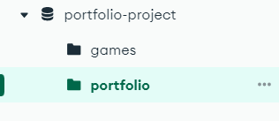
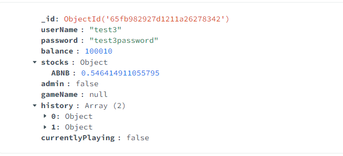

Video for final project is here: https://drive.google.com/file/d/1X12El65bCtI_y840_nnG_hHWXgNzfBCq/view?usp=sharing
# Layout

dump: contains database. 
node_modules: contains all the modules. 
tests: contains all the required test. 
app.mjs: Entry point of our application, contains all the routes and endpoints. 
attributions.md: This markdown file contains all the attributions. 
db.mjs: This file handles all the databse connections. 
portfolio.mjs: This file contains all the required functions to make or application work, they respond to the routed in the app.mjs. 
readme.md: This document contain all the explaination. 
public: This folder contain all teh required html, css, js, jQuery and font files 

# Architechure

To run the server run "nodemon app.mjs".  

The entry point of a project is app.mjs file. We are using portal number 8820 to host our server and app.mjs file. We are having a function named startapp() which is containing all the routes. And after that function we have to call the startup function to initiate our application. And we also have a method at the end to check if there is any disturbance on the command line to close the server.

## API/HTTP requests
default home screen
Request Syntax: GET / 
Description: Shows the homescreen where player can use login, register and login as an admin. 

Register(): 
Request Syntax: POST /register?userName=test1&password=test1&adminInput=true&gameName=1 
Description: Registers a new user with the provided username, password, admin input, and game name. Admin input grants extra permissions. Initializes user's balance, stocks, and game-related information. 

Login(): 
Request Syntax: GET /login?userName=test1&password=test1 
Description: Authenticates a user based on the provided username and password. Returns the player object if authentication is successful. 

Logout(): 
Request Syntax: GET /logout 
Description: Destroys data of current session, logs out player. 

user():  
Request Syntax: GET /user 
Description: Shows the default user page with all of his information, uses session data 

adminLogin():  
Request Syntax: GET /adminLogin?userName=test1&password=test 
Description: Almost same as login, but instead directs the page to admin interface. 

admin():  
Request Syntax: GET /admin 
Description: Shows the default admin page with all of his information, uses session data 

Buy(): 
Request Syntax: POST /buy?userName=test1&stockSymbol=AAPL&amount=100 
Description: Allows a user to purchase stocks with the specified username, stock symbol, and amount. Deducts the purchase amount from the user's balance and updates their portfolio. 

Sell(): 
Request Syntax: POST /sell?userName=test1&stockSymbol=AAPL&quantityToSell=100 
Description: Enables a user to sell stocks with the specified username, stock symbol, and quantity. Adds the sale amount to the user's balance and updates their portfolio.

GetValue(): 
Request Syntax: GET /getValue?userName=test1 
Description: Retrieves the total value of a user's portfolio in terms of stocks. 

ChangeBalance(): 
Request Syntax: POST /changeBalance?userName1=test1&userName2=test2&newBalance=100000 
Description: Admin-specific function to change the balance of a specified user to a new amount. 

CreateGame(): 
Request Syntax: POST /createGame?userName=test1&gameName=01 
Description: Admin-specific function to create a new game instance with a given name and associated players. 

GetPortfolio(): 
Request Syntax: GET /getPortfolio?requestingUserName=test1&targetUserName=test2 
Description: Allows a user to view another player's portfolio at the cost of fifty dollars, deducted from the requester's balance. 

## TESTS

DON'T FORGOT TO EMPTY THE COLLECTIONS IF YOU ARE RUNNING TESTS AGAIN.

To run the tests run mocha test-portfolio.mjs after importing the database by using command

* POST /register
 This test will check register() and all of our tests are passing.

* GET /login
This test will check login() and all of our tests are passing.

* POST /buy
This test will check buy() and all of our tests are passing.

* POST /sell
This test will check sell() and all of our tests are passing.

* GET /getValue
This test will check getValue() and all of our tests are passing.

* GET /createGame
This test will check createGame() and all of our tests are passing.

* GET /getPortfolio
This test will check getPortfolio() and all of our tests are passing.

* POST /changeBalance
This test will check changeBalance() and all of our tests are passing.

* The last function checks for the winner, it is also working properly.

Below its showing that all the tests are passing

# Database

Importing a Database:

Ensure that MongoDB is running.

Open your terminal or command prompt.

use this command "mongorestore --db portfolio-project ./dump/portfolio-project"

Our database looks like this. 

 The name of the databse is portfolio-project and it will contain 2 collections, games and portfolio. 

Games will contain all the players in one lobby, like this. 
 

Portfolio will contain all the players existing in the game. 

